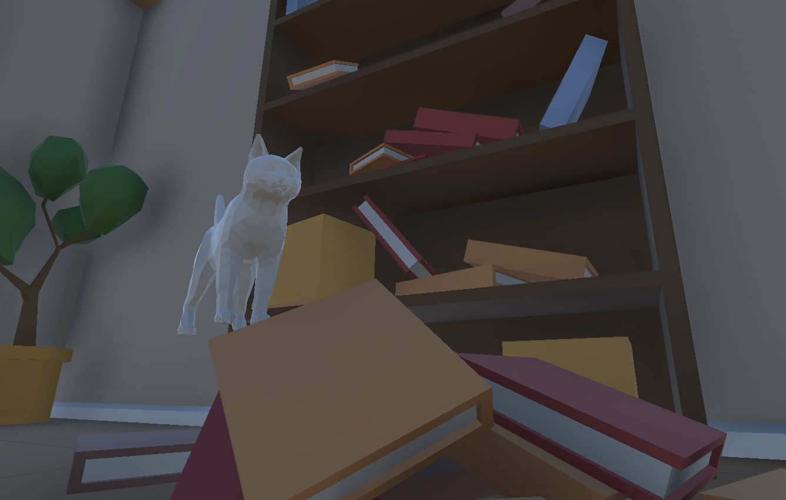

# Meow 'em Down
*A simple 3D game made during university Unity course.*  
Cat simulator, where you can throw objects on the floor from all the places. Uses Rigidbody and colliders a lot.

## Controls
 - WASD - movement
 - Space - jump
 - LMB, RMB - kick with paws
 - E - meow

## With help from
 - https://github.com/lukeskt/InputSystemFirstPersonCharacter/
 - https://assetstore.unity.com/packages/3d/props/interior/low-poly-cartoon-house-interiors-167425
 - https://www.turbosquid.com/3d-models/3d-base-mash-cat-2080612